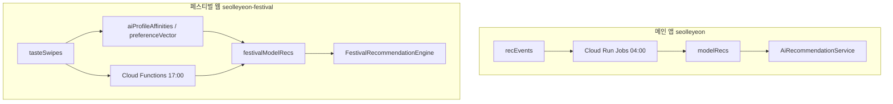

# 설레연 추천 시스템 브리핑

## 1. 메인 앱 (`seolleyeon`) — 개괄

### 하루 1회 배치 (Cloud Run Jobs)

```
매일 04:00 KST
  Cloud Scheduler
    → Workflows `recs-pipeline`
        → recs-export     : recEvents → GCS CSV
        → recs-clip/svd/knn (병렬)
        → recs-rrf        : 3개 소스 RRF 병합
        → recs-verify
```

- **코드**: `lib/ai_recommend_model/` (학습/병합), `recsys/` (Cloud Run 진입점)
- **배포**: `infra/deploy.sh`, 이미지 `recs-pipeline`, 리전 `asia-northeast3`
- **입력 이벤트**: `recEvents/{uid}/events` (프로필 열람, like, nope, AI 취향 카드 등)
- **출력**: `modelRecs/{uid}/daily/{YYYYMMDD}/sources/{clip|svd|knn|rrf}`
- **앱 로딩**: `AiRecommendationService` — 오늘자 `rrf` → 없으면 `clip` → `svd` → 랜덤 폴백

### 알고리즘 역할

| 알고리즘 | 역할 |
|---------|------|
| **CLIP** | 사진 임베딩 + like/dislike preference vector → 유사도 Top-N |
| **SVD** | 협업 필터링 (행렬 분해) |
| **KNN** | 이벤트 기반 이웃 추천 |
| **RRF** | CLIP/SVD/KNN 순위를 Reciprocal Rank Fusion으로 통합 |

### Cloud Run이 하는 일

HTTP API 서버가 아니라 **배치 Job**입니다. `recsys/main.py --step export|clip|svd|knn|rrf|verify` 가 각 Job 컨테이너에서 Python v3 스크립트를 실행하고 Firestore에 결과를 씁니다.

---

## 2. 페스티벌 웹 (`seolleyeon-festival`) — 이번에 추가한 구조

### 호감도 데이터

| 저장 위치 | 내용 |
|-----------|------|
| `festivalTickets/{ticketId}/tasteSwipes` | AI 카드별 like/dislike (`aiProfileCode`: f1..f20, m1..m20) |
| `festivalTickets/{ticketId}.aiProfileAffinities` | `{ "f3": 1.0, "m7": 0.0, ... }` |
| `festivalTickets/{ticketId}.preferenceVector` | CLIP preference vector (취향 학습 완료 시 계산) |

### 추천 출력

`festivalModelRecs/{ticketId}/daily/{YYYYMMDD}/sources/clip`

### 실행 경로 (3가지)

1. **웹 라이브** — `FestivalRecommendationEngine` (임베딩 있으면 즉시 코사인 유사도)
2. **Cloud Functions** — 취향 완료 트리거 + 매일 17:00 KST 배치 (`festival_recommendations.ts`)
3. **Python 배치** — `festival_web/ai_recommend_model/festival_run_all.py` (운영/초기 세팅용)

### 사전 준비 (1회)

```bash
cd festival_web/ai_recommend_model
pip install -r requirements.txt
python festival_export_ai_embeddings.py --project seolleyeon-festival
python festival_export_profile_embeddings.py --project seolleyeon-festival
```

AI 카드·참가자 프로필 CLIP 임베딩이 없으면 휴리스틱(MBTI/학과/나이) 폴백으로 동작합니다.

---

## 3. 앱 vs 웹 한눈에



---

## 4. 관련 파일

| 영역 | 경로 |
|------|------|
| 메인 ML | `lib/ai_recommend_model/` |
| Cloud Run | `recsys/main.py`, `recsys/README.md`, `infra/deploy.sh` |
| 메인 앱 클라이언트 | `lib/services/ai_recommendation_service.dart` |
| 페스티벌 웹 클라이언트 | `festival_web/lib/recommendation/` |
| 페스티벌 ML | `festival_web/ai_recommend_model/` |
| 페스티벌 Functions | `festival_web/functions/src/festival_recommendations.ts` |
